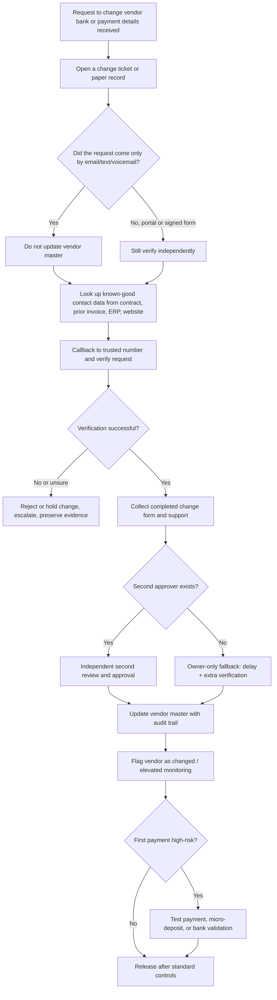

# Safe Verification of Vendor Banking and Payment Detail Changes for Small Businesses

## Executive summary

The safest practical process for a micro or small business is simple in principle: **never change a vendor’s bank or payment details based on a single inbound message**, especially ordinary email. The minimum viable control stack is: **document the request, verify it by an independent callback to a known-good number, require a second approval whenever a second person exists, and do not release the first payment to the changed account on the same day unless an owner formally overrides after extra checks**. That design aligns with FBI, FFIEC, Nacha, NCSC, ACSC, and bank guidance on business email compromise, out-of-band verification, layered security, dual authorization, and payment-risk controls. citeturn39view0turn27view0turn36view0turn41view1turn18search6turn28view0

This matters because vendor-payment fraud is not a niche edge case. In the FBI’s 2025 IC3 report, **Business Email Compromise accounted for 24,768 complaints and about $3.05 billion in reported losses**, and the FBI describes BEC as one of the most financially damaging online crimes. Modern attacks include spoofed domains, hijacked real email threads, vendor impersonation, payroll impersonation, and other “false pretenses” schemes that trick an authorized employee into sending a legitimate payment to the wrong account. citeturn10view0turn39view0turn36view2

For very small teams, the best trade-off is usually **procedure first, technology second**. A written callback rule, a short change form, a mandatory delay, and a second-person review where possible are cheap and highly effective. More technical controls such as vendor portals, bank account validation, ACH filters/blocks, Positive Pay, transaction limits, DMARC/SPF/DKIM, and platform approval workflows add significant protection and should be implemented as budget and complexity allow. citeturn37view1turn28view0turn29view0turn26view0turn41view1turn41view2

If you are a **single-owner business with no second approver**, you cannot create true segregation of duties, so you should substitute a stronger fallback stack: **known-good callback, independent source lookup, no same-day first payment, and either a micro-deposit/test payment or a platform/bank validation control for larger or higher-risk changes**. ICAEW notes that in smaller businesses, direct owner involvement can partly compensate for limited segregation of duties, but it does not eliminate fraud risk. citeturn37view1turn33view0

Jurisdiction matters at the margins, but not in the core design. The core rule set above is portable. The main country-specific differences are in **payment-network rules and bank features**. In the U.S., Nacha’s 2026 rules now require corporate ACH users to maintain risk-based fraud procedures; in the UK, **Confirmation of Payee** adds a payee-name check for many bank transfers; in Australia, official guidance explicitly recommends formal payment-change processes and callbacks using known numbers. citeturn36view0turn36view1turn19search1turn18search11turn18search6

## Threat model and control principles

The threat model is broader than “fake invoice email.” The main scenarios are: a criminal **spoofs** a vendor’s domain or display name; a criminal **compromises the real vendor mailbox** and edits legitimate invoices or email threads; a criminal impersonates an executive, employee, settlement agent, or bank; or a criminal uses social engineering across **email, text, phone, and fake websites** to create urgency and bypass normal controls. The FBI, U.S. Bank, ACSC, NCSC, and ICAEW all describe these patterns, including legitimate-looking invoices with changed bank details and attacks timed to existing business relationships. citeturn39view0turn28view0turn18search4turn17search0turn37view0

That threat model leads to four control principles.

First, **separate the communication channel from the verification channel**. If the request arrived by email, verify by a callback to a phone number you already trust from your records, an old contract, a previously known invoice, the vendor’s published website, or a trusted portal. Do not use the number inside the request itself, because attackers control that channel. citeturn39view0turn18search6turn18search11turn28view0turn2search0

Second, **treat every change to an existing vendor’s bank details as high risk regardless of amount**. ICAEW explicitly says that a change of bank details should always be a red flag requiring follow-up checks including a phone call, and Wells Fargo advises businesses to watch for imposters impersonating vendors or alleged vendors changing payment instructions. citeturn37view0turn26view0

Third, **use layered controls rather than one “magic” control**. FFIEC guidance emphasizes layered security for high-risk transactions, including out-of-band verification, dual authorization, transaction limits, positive pay, debit blocks, fraud monitoring, and controls over changes to account-maintenance activities. U.S. Bank and Wells Fargo similarly recommend dual authorization or dual custody, transaction limits, account validation, ACH filters/blocks, Positive Pay, and cooling-off periods for risky changes. citeturn27view0turn29view0turn28view0turn26view0

Fourth, **email security controls are necessary but not sufficient**. SPF, DKIM, and DMARC make domain spoofing harder, and NCSC and ACSC recommend them; ACSC specifically recommends DMARC policies that reject messages failing SPF and/or DKIM. But those controls do not solve attacks where a criminal uses a real compromised mailbox or a legitimate business process. That is why process controls still matter. citeturn41view1turn41view0turn41view2turn39view0turn37view0

The most practical trust order for channels in a small business is:

| Channel | Practical use | Main weakness | Best practice |
|---|---|---|---|
| Ordinary inbound email | Intake only | Easily spoofed; real threads can also be compromised | Never approve a change from email alone. citeturn39view0turn37view0 |
| Phone | Strong if **you** initiate to a known-good number | Caller ID can be spoofed; inbound calls are weak | Use callback only, on a trusted number. citeturn28view0turn18search6turn39view0 |
| Secure vendor portal | Stronger because it structures data collection and approvals | Depends on platform setup and permissions | Prefer portals with approval workflows and audit trails. citeturn30view0turn30view1turn31view0turn30view4 |
| In-person | High assurance fallback for high-risk vendors | Not scalable | Use for unusual, large, urgent, or high-value changes when practical. citeturn39view0 |
| Bank validation or micro-deposits | Strong evidence that the account is valid/open; sometimes ownership confirmed too | Slower; may not fully prove ownership by itself | Use for first use, changed details, or higher-risk payments. citeturn33view0turn29view0turn30view1 |

## Verification workflow for micro and small teams

The following procedure is designed for single-owner firms and teams of roughly 2–10 staff. It is intentionally conservative because the real-world fraud pattern is that attackers exploit “routine” exceptions, urgency, and trust. citeturn28view0turn39view0turn18search6



A prioritized step-by-step workflow:

1. **Receive but do not trust the request.** Log the date, time, vendor name, sender address, payment method, and the exact change requested. If the request was by email, preserve the original email and attachment. Do not edit the vendor record yet. This creates the audit trail that many small businesses lack and supports later response if fraud is suspected. citeturn36view0turn45view1

2. **Check for red flags before contacting anyone.** Red flags include urgency, secrecy, a last-minute “exception,” changed bank details, changed contact person, spelling anomalies, cross-border account changes, or a request that bypasses normal process. These are classic features of BEC and social-engineering campaigns. citeturn39view0turn17search1turn18search15turn28view0

3. **Find a known-good verification path.** Use your own records, old signed contract, prior remittance advice, previously paid invoice, or the vendor’s official website. Do not use phone numbers, links, or call-back instructions in the suspicious request. citeturn39view0turn18search6turn2search0turn28view0

4. **Perform an out-of-band callback.** Call the known-good number and verify the change with someone authorized by the vendor. Confirm the reason for the change, the date it takes effect, the payment method, and enough identity details to make the caller comfortable that you are speaking with the right party. FFIEC, FBI, ACSC, ICAEW, and banks all support this kind of independent verification. citeturn27view0turn39view0turn18search6turn37view0turn28view0

5. **Use a structured change form.** Require a short written confirmation from the vendor through your form or secure portal, even if you verified by phone. This is what turns a one-off conversation into a repeatable control. Small businesses often need this more than expensive software. Nacha’s current U.S. guidance also points organizations toward documented, risk-based processes. citeturn36view0turn36view1

6. **Require a second approval if any second authorized person exists.** A co-owner, manager, office lead, external bookkeeper, or CPA can serve as the independent reviewer. Segregation of duties and authorization controls are standard control activities, and banks explicitly recommend dual authorization or dual custody for payment setup and release. citeturn37view1turn26view0turn29view0turn28view0

7. **If you are the only approver, substitute stronger controls.** For a one-person business, require a mandatory delay, redo the callback yourself from a fresh source, and use either a small test payment, micro-deposit, or a platform/bank validation control for higher-risk changes. ICAEW notes that direct owner involvement can partly compensate for limited segregation of duties in small businesses; Nacha notes that micro-transactions can validate that an account is open and can accept ACH entries, although ownership validation may still need stronger methods. citeturn37view1turn33view0

8. **Update the vendor master only after verification is complete.** Record who verified, which number was used, when the callback occurred, what evidence was reviewed, and who approved the change. Prefer systems that preserve vendor-edit approvals and history. citeturn30view0turn30view1turn23search7

9. **Do not release the first payment to changed details immediately.** Put the changed vendor on elevated monitoring. For large, urgent, international, or unusual first payments, add a cooling-off period and a stronger validation step such as micro-deposits, a test payment, bank-account linking, or a bank account-validation service. U.S. Bank specifically recommends cool-off periods for high-risk changes, and Nacha recognizes micro-transactions, prenotes, APIs, and validation services as acceptable account-validation methods. citeturn28view0turn33view0turn29view0turn31view0

10. **Review the first successful payment and then downgrade risk.** After the first payment clears and the vendor confirms receipt through an independent channel, mark the record “verified on [date].” That way, future payments can return to normal approval thresholds unless another change occurs. Nacha expressly distinguishes first-use and changed-account situations from known-good history. citeturn33view0

## Thresholds and control matrix

The threshold question is best split in two: **bank-detail changes** and **payments to changed details**. My recommended default for micro teams is: **all changes to existing vendor bank details require independent verification every time, regardless of amount**. The amount thresholds should apply mainly to **releasing the first payment after the change**, because the change itself is the attack surface. That recommendation is stricter than many small businesses currently use, but it fits the documented BEC pattern and the control guidance on out-of-band verification, dual authorization, and cooling-off periods. citeturn37view0turn28view0turn27view0turn26view0

Recommended default approval thresholds for micro and small teams:

| Event | Recommended default for micro teams | Why |
|---|---|---|
| Any change to existing vendor bank details | **Always** require callback to known-good number and written record. If 2+ authorized people exist, require second-person approval **every time**. | Bank-detail changes are a standing BEC red flag, even for small amounts. citeturn37view0turn26view0turn39view0 |
| First payment to new/changed details up to **local-currency equivalent of 1,000** | Callback + written form + hold until next business day. If single owner only, this can be owner-approved after delay. | Keeps friction reasonable while preventing “same-day rush” wins for attackers. citeturn28view0 |
| First payment over **1,000** | All of the above **plus second-person approval** if available. | Dual authorization is a strong, widely recommended control. citeturn29view0turn26view0turn27view0 |
| First payment over **10,000**, or any international wire, RTP/instant payment, or unusual urgency | Callback + written form + second-person approval + owner sign-off + stronger validation such as test payment, micro-deposit, or bank validation; no same-day release unless documented emergency. | Banks specifically recommend out-of-band verification, beneficiary validation, transaction limits, and cooling-off periods for higher-risk payments. citeturn28view0turn29view0turn33view0 |
| First payment over **25,000** or over **5% of monthly operating cash outflow**, whichever is lower | Treat as high risk regardless of history; re-verify contact, review contract/invoice history, and use the strongest available bank/platform control. | This is a prudent internal control threshold for micro firms with concentrated cash risk; it is a recommendation, not a regulatory rule. It is supported by the general guidance on layered security, value limits, and risk-based procedures. citeturn27view0turn36view0 |
| Any request marked urgent, confidential, off-hours, or “exception” | Escalate to highest-risk path regardless of amount. | Social-engineering campaigns rely on urgency and process bypass. citeturn28view0turn39view0turn17search1 |

For a **single-owner** business, use this fallback rule: *every bank-detail change is high-risk; every first payment to changed details waits until the next business day; payments above 1,000 require an extra verification step; payments above 10,000 should not be sent without either a trusted outside reviewer or a bank/platform validation control.* That is an operational recommendation for tiny firms, not a legal standard. It reflects the fact that true segregation is impossible in a one-person environment. citeturn37view1turn33view0turn28view0

Comparison table of controls by cost, complexity, and likely effectiveness for micro teams. The ratings below are my practical assessment for very small businesses, informed by the cited guidance and product/bank capabilities.

| Control | Cost | Complexity | Likely effectiveness | Practical note |
|---|---:|---:|---:|---|
| Known-good callback | Low | Low | High | Usually the best first control for small teams. Explicitly recommended by FBI, ACSC, ICAEW, and banks. citeturn39view0turn18search6turn37view0turn28view0 |
| Short change request form | Low | Low | Medium-High | Cheap way to create an audit trail and reduce ad hoc exceptions. Supports Nacha-style documented procedures. citeturn36view0 |
| Second-person approval | Low | Low-Medium | High | Very strong where staffing allows; recommended by banks and aligned with segregation-of-duties principles. citeturn26view0turn29view0turn37view1 |
| Mandatory next-day release for first payment | Low | Low | Medium-High | Slows attackers and gives time for detection; supported by cooling-off logic. citeturn28view0 |
| Micro-deposit or test payment | Low | Medium | Medium-High | Good especially for changed details or higher values; validates that account is open, though ownership may need more. citeturn33view0 |
| Vendor portal with edit approvals | Medium | Medium | High | Strong because it structures data capture, approvals, and history. citeturn30view0turn30view1turn30view4 |
| Bank account validation service | Medium | Medium | High | Stronger than manual review alone for account status/ownership checks. citeturn29view0turn33view0turn31view0 |
| ACH blocks / filters / Positive Pay / payee validation | Medium | Medium | High | Best as bank-layer protection; very valuable once payment volume grows. citeturn29view0turn26view0 |
| Transaction limits and dual authorization in bank/payments platform | Low-Medium | Medium | High | One of the best “small business treasury” upgrades. citeturn29view0turn30view3turn30view4 |
| SPF, DKIM, DMARC on your domain | Low-Medium | Medium | Medium | Important for anti-spoofing and brand protection, but not enough against compromised real accounts. citeturn41view1turn41view2 |
| Phishing-resistant MFA or the strongest MFA your stack supports | Low-Medium | Medium | High | Protects the email and payment systems that attackers target first. FFIEC and CISA emphasize MFA and layered authentication. citeturn43view0turn39view0turn16search1 |
| End-user digital signatures | Medium-High | High | Niche / Medium | Useful when you already manage certificate trust; usually not the first spend for a micro team. NIST notes the value of digital signatures, but also the certificate-chain and CA requirements. citeturn44view2turn44view1turn44view0 |

## Templates and implementation pack

The following templates implement the most consistently supported controls in the source material: independent verification, known-good callback, documented approval, and an auditable record of who approved what and when. citeturn39view0turn37view0turn26view0turn36view0

**Vendor-change request email template**

```text
Subject: Vendor payment detail change verification required

Hello [Vendor Name / Contact Name],

We received a request to update the payment details for vendor [Vendor Name].

For security reasons, we do not change bank or payment instructions based on email alone.
Please complete the attached/payment-details change form or send the following information from your authorized contact:

1. Legal business name
2. Authorized requester name and title
3. Effective date of change
4. Payment method affected (ACH / wire / local transfer / check)
5. New bank details
6. Reason for the change
7. Best existing business phone number for verification

After we receive the form, we will complete an independent callback using contact details from our records or your official website.
Please do not include urgency language unless there is a documented business deadline.

Thank you,
[Your Name]
[Company]
[Direct Phone]
```

**Phone verification script**

```text
Hello, this is [Name] from [Company]. I am calling to verify a requested change to payment details for [Vendor Name].

For security, I am calling a number from our records / your official website.

Before we proceed, please confirm:
- Your full name and title
- That you are authorized to request payment detail changes for [Vendor Name]
- The reason for the change
- The payment method being changed
- The effective date
- The last 4 digits of the old account on file, if you know them
- The last 4 digits of the new account, or the final characters of the IBAN
- Whether this change applies to all future invoices or only a specific invoice

Optional challenge questions:
- Purchase order or invoice number involved
- Remittance email address already on file
- Vendor tax identifier or registration number on file

Closing statement:
Thank you. We will review this through our approval process. We do not guarantee same-day activation of changed payment details.
```

**Short change-approval form**

```text
Vendor Payment Detail Change Approval Form

Vendor legal name:
Vendor ID / account number:
Requested by:
Requester title:
Requester email:
Known-good callback number used:
Date/time callback completed:
Verified by:
Second approver:
Payment method affected:
Old details reference:
New details reference:
Reason for change:
Supporting documents reviewed:
Risk flags noted:
[ ] Urgent request
[ ] International payment
[ ] New contact person
[ ] First payment over threshold
[ ] Different country / bank than usual
Decision:
[ ] Approved
[ ] Approved with delay until: ________
[ ] Approved subject to test payment / micro-deposit
[ ] Rejected / escalated
Notes:
Signatures / initials:
Date:
```

**Sample one-page policy**

```text
Policy: Changes to Vendor Banking or Payment Details

Purpose
To prevent payment diversion, BEC, and invoice fraud.

Policy
1. The business will not change vendor banking or payment details based solely on inbound email, text, chat, voicemail, or unsigned documents.
2. Every change requires:
   - a documented change request,
   - independent verification using a known-good contact method,
   - approval according to the threshold table,
   - and an audit trail.
3. If two authorized people exist, all changes to existing vendor payment details require second-person approval.
4. The first payment to changed details will not be released on the same day unless an owner documents a specific business necessity and completes extra verification.
5. Urgent, unusual, confidential, after-hours, or cross-border requests are treated as high risk regardless of amount.
6. Staff must report suspected fraud immediately to management and the bank.
7. The business will retain change records with normal accounting records under its document-retention policy.

Exceptions
Exceptions require written owner approval and must record the compensating controls used.
```

**Short SOP for implementation**

```text
SOP: Verifying vendor payment detail changes

1. Open a change record.
2. Do not edit the vendor master.
3. Check for red flags.
4. Obtain known-good contact details from trusted records.
5. Call the vendor and verify the request.
6. Complete the change-approval form.
7. Obtain second approval if available.
8. Update the vendor record and note who made the change.
9. Flag the vendor as "recently changed."
10. Apply first-payment elevated controls.
```

**Short SOP for suspicious-fraud response**

```text
SOP: If fraud is suspected

1. Stop the change or payment immediately.
2. Contact the bank using its official number.
3. Request recall, reversal, hold, or indemnity support as applicable.
4. Preserve emails, headers, invoices, and call notes.
5. Change passwords, sign out sessions, and review forwarding rules if email compromise is possible.
6. Notify affected vendor and internal leadership through trusted channels.
7. File required fraud/cyber reports in the relevant jurisdiction.
8. Document what happened and freeze similar pending changes.
```

## Incident response, training, and platform features

When fraud is suspected, **speed matters more than perfection**. FBI and IC3 guidance says to contact your financial institution immediately and report to IC3, while ACSC guidance says to contact the bank as soon as possible, change access credentials, sign out sessions, enable MFA, remove malicious forwarding rules, notify contacts, and keep records of response steps. citeturn39view0turn13view0turn45view0turn45view1

A practical response timeline for a small business:

| Time window | Action |
|---|---|
| First 15 minutes | Stop the payment or change. Freeze the vendor record. Call your bank using its official number. Ask about recall, reversal, hold, beneficiary-bank contact, and any indemnity or hold-harmless process. |
| First hour | Preserve email evidence and invoices. If email compromise is possible, change passwords, sign out all sessions, enable MFA, and check forwarding rules, mailbox rules, login activity, and connected apps. |
| Same day | Contact the real vendor through a known-good channel. Review all recent vendor changes and pending payments for similar patterns. Notify affected staff and relevant counterparties. |
| Same day if in the U.S. | File an IC3 complaint with full banking information and the transaction details; IC3’s Recovery Asset Team can assist with freezing funds in qualifying cases. |
| Next 24 hours | Document the incident, who approved what, which controls failed, and which pending payments should be held. Report to local authorities, insurer, or regulator where required. |
| Next week | Reset procedures: retrain staff, add missing bank controls, and review whether portal approvals, limits, or validation services should be enabled. |

Those response steps are grounded in FBI/IC3 and ACSC guidance, including immediate bank contact, preserving evidence, reporting early, checking mailbox rules and forwarding, and notifying contacts and relevant third parties. citeturn39view0turn13view0turn45view0turn45view1

A short staff training checklist should fit on one page and be repeated at onboarding and at least quarterly. The checklist should say:

- Never change vendor payment details from email alone. citeturn39view0turn37view0
- Never use the phone number or link provided in the suspicious message. citeturn39view0turn18search6turn28view0
- Treat urgency, secrecy, and “exception” requests as fraud indicators. citeturn28view0turn17search1
- Assume caller ID can be spoofed. citeturn28view0
- Never share one-time passcodes or MFA prompts. citeturn28view0
- Report suspicious requests immediately and do not worry about “false alarms.” citeturn45view0turn18search15
- If you receive a request from a known vendor that feels off, stop and callback using known-good records. citeturn39view0turn18search6turn37view0

For bank and platform selection, prefer **features**, not brands. The best small-business platforms are the ones that support **vendor edit approvals, threshold-based payment approvals, vendor self-service or secure onboarding, audit trails, and account-validation options**. As examples, Ramp supports structured vendor approvals for new vendors and vendor edits, vendor payment-detail requests, business review of vendor-submitted changes, bank-account linking, and micro-deposit verification in some flows; QuickBooks Online Advanced / Bill Pay Elite supports bill approval and payment release workflows by amount or vendor conditions; Wise Business supports one- or two-person payment approvals and amount thresholds; and BILL supports approval policies with thresholds and multiple approvers plus supplier-portal workflows. citeturn30view0turn30view1turn31view0turn30view4turn30view3turn23search1turn23search0turn23search7

On the banking side, prefer institutions and treasury packages that offer **dual authorization, transaction limits, account validation, ACH blocks/filters, ACH Positive Pay or equivalent exception review, Positive Pay with payee validation for checks, alerts, and beneficiary or account validation support**. U.S. Bank and Wells Fargo both publicly describe these controls, and FFIEC also highlights out-of-band verification, value limits, dual authorization, positive pay, debit blocks, and controls over account-maintenance changes. citeturn29view0turn26view0turn27view0

If you operate in a market where bank-side **payee name checking** exists, prefer it. In the UK, **Confirmation of Payee** provides an extra authentication step by checking whether the entered payee name matches the receiving account name and is specifically intended to reduce misdirected payments and APP fraud. That does not replace your callback process, but it is a strong extra control. citeturn19search1turn19search2

A small but important technical baseline for your own business should include **MFA on email and payment systems, anti-spoofing records for your domain, and periodic review of mailbox rules and account activity**. NCSC and ACSC recommend SPF, DKIM, and DMARC to reduce spoofing; ACSC specifically recommends DMARC reject for failed SPF/DKIM, and CISA’s Cybersecurity Performance Goals characterize SPF/DKIM/DMARC with a reject policy as high-impact baseline email protection. ACSC also stresses that enabling MFA is one of the most important defenses after email incidents. citeturn41view1turn41view2turn25search5turn45view0turn45view1

**Open questions and limitations.** This report does not assume a specific country, bank, ERP, or payment stack, so exact legal reporting obligations, bank product names, account-validation coverage, and reimbursement standards can vary. The threshold amounts above are therefore **recommended internal-control defaults**, not legal requirements. If your business sends high-value international wires, uses real-time payment rails, or has industry-specific payment rules, you should tighten the thresholds and adapt the incident-reporting path to your jurisdiction and bank. citeturn36view0turn39view0turn45view0