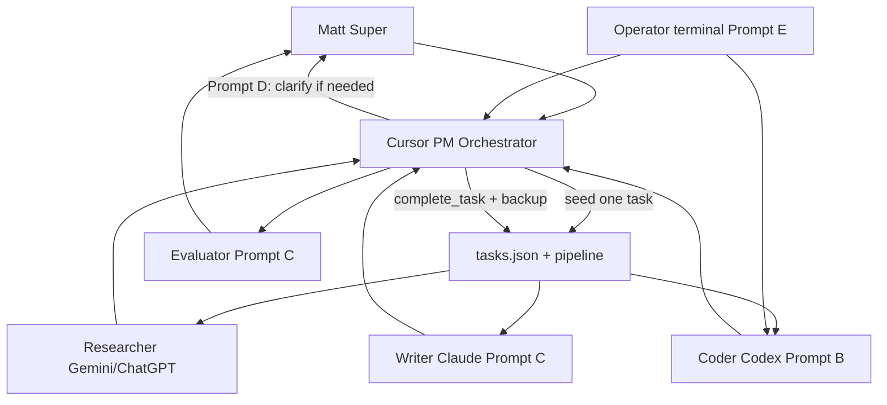

# MMI Orchestrator Scope

Last updated: 2026-07-01  
Authority: Matt (Super)  
Status: **LOCKED** — agent behavior and operator scope for MMI local-first stack  
Repo: `C:\Architectapp_clean` / `/mnt/c/Architectapp_clean`

---

## Purpose

Formalize how MMI runs multi-step work using specialized lanes — without cloud orchestration runtime, without Social Architect swarm, and without scope invention.

This document merges:

1. Orchestrator workflow (deconstruct → assign → synthesize → evaluate)
2. Four reviewed prompt patterns (adapted per lane)
3. Hard stops from `MMI_ACTIVE_SCOPE.md` and `MMI_LOCAL_CLOUD_POLICY.md`

---

## What MMI orchestration is

| Aspect | Definition |
|--------|------------|
| **Orchestrator** | Matt (Super) + Cursor PM — decompose objectives, seed queue, route lanes |
| **Execution surface** | Local Mini PC — `tasks.json`, `mmi/task_pipeline.json`, project brain |
| **Agent lanes** | Human-steered Cursor/Claude/Codex/Gemini tabs — not auto-spawned bots (see **Addendum 04** for Air-Lock defensive inflation exception) |
| **Quality gate** | Gemini Paid API (Evaluator) + Matt approval before substantive build/cloud |
| **Operator desk** | WSL terminal + command center / war room CLI |

Orchestration is **queue-driven and local**. There is no hosted orchestrator service.

---

## Lane map

| Generic role | MMI lane | Owner | Primary output |
|--------------|----------|-------|----------------|
| **Orchestrator** | Super + PM | Matt + Cursor | `tasks.json`, pipeline, status docs |
| **Researcher** | Main / deep research | Gemini, ChatGPT | Research notes → project brain when tasked |
| **Writer** | Design | Claude | Specs, architecture markdown |
| **Coder** | Backbone | Codex | Python CLI, scripts, war room |
| **Evaluator** | Audit | Gemini Paid API | PASS/FAIL/NEEDS_MATT findings |
| **Security Intel (product)** | Research synthesis | Gemini → Claude → ChatGPT verify | `lanes/RESEARCH_*.md`, MVP architecture |

Supporting references: `status/MMI_LANE_ROUTING.md`, `CODEX.md`, `architecture/MMI_WAR_ROOM_SPEC.md`, `lanes/MMI_SECURITY_INTEL_LANE.md`.

---

## Orchestrator workflow (mandatory)

For every **complex objective**:

1. **Deconstruct** — Break into bounded steps; one pending task in `tasks.json` at a time
2. **Assign** — Map each step to Researcher, Writer, Coder, or Evaluator via `assignee` + `tier`
3. **Collect** — Outputs go to `mmi/project_brain/` paths named in task instruction
4. **Synthesize** — Cursor PM updates status; does not absorb every lane’s work
5. **Evaluate** — Evaluator or Matt before next pipeline seed or cloud touch
6. **Complete** — `scripts/complete_task.py` or `scripts/reload_mmi_pipes.py` — never leave pipe DRY silently

Matt **build auth** required for: new product scope, cloud provider/destination, lane reactivation (Social Architect, DAX, Trades, NorthStar).

---

## Prompt pack (formalized)

Four patterns were reviewed. **None are global system prompts.** Each applies to specific lanes only.

### A. Orchestrator (original)

**Source intent:** Manage Researcher, Writer, Coder, Evaluator; deconstruct workflow; synthesize; pass to Evaluator.

**MMI rule:** Implemented by **Matt + Cursor PM + pipeline** — not a separate AI runtime.

**Do not:** Auto-run all lanes in one agent; invent scope; skip `tasks.json`.

---

### B. Autonomous problem-solving loop (Prompt 1)

**Source steps:** Analyze → one tool → Observe → Reflect → Execute & submit. Never assume success.

| Verdict | **Adapt — Coder (Codex) only** |
|---------|----------------------------------|
| Use when | Active `PROJECT: MMI` task assigned to Codex |
| Do not use | Global default for all agents; PM queue ops; open-ended repo search |

**Codex execution loop:**

1. Analyze — smallest steps within task instruction + `CODEX.md`
2. One tool per iteration — local CLI; no npm, `web/`, `ops/run.py`, NorthStar
3. Observe — read output; on failure, adjust plan
4. Reflect — `py_compile`, script self-test, or pipe reload where applicable
5. Complete — `scripts/complete_task.py` with summary + `output_files`

---

### C. QA refinement loop (Prompt 2)

**Source steps:** Draft → Critique → Revise → output **only** polished final (no monologue).

| Verdict | **Adapt — Writer + Evaluator** |
|---------|----------------------------------|
| Writer (Claude) | Specs/status docs; mark unknowns `NEEDS MATT` |
| Evaluator (Gemini Paid API) | Structured PASS/FAIL/NEEDS_MATT + findings — gate evidence may be visible to Matt |
| Do not use | Codex default (use compile/test instead); hidden audit for gates |

**Evaluator output shape:**

- `verdict`: PASS | FAIL | NEEDS_MATT
- `findings`: bulleted
- `required_fixes`: if FAIL

---

### D. Collaborative assistant (Prompt 3)

**Source steps:** State what you need → give examples → pause for input. Never guess preferences.

| Verdict | **Adapt — Orchestrator (PM + Matt) primary** |
|---------|-----------------------------------------------|
| Use when | Super decisions: scope, provider, build auth, lane reactivation, product direction |
| Do not use | Codex mid-task preference polling; guessing cloud/local or NorthStar bridge |

**PM clarification rule:**

1. State what blocks progress
2. Offer 2–3 concrete options (not open brainstorming)
3. Pause — no pipeline seed until Matt chooses

---

### E. Terminal operator setup (Prompt 4)

**Source intent:** WezTerm + Zsh + Starship + Nerd Font for dev terminal.

| Verdict | **Adapt — operator desk only (not an agent prompt)** |
|---------|------------------------------------------------------|
| Keep | WezTerm, JetBrains Mono Nerd Font, Starship, zsh plugins |
| Drop | `swarm-up` / `main.py`, “Swarm Node” branding, broken/incomplete install URLs |
| MMI aliases | See `status/MMI_TERMINAL_ALIASES.md` (when created) or cheatsheet below |

**MMI operator aliases (WSL):**

```bash
export MMI_ROOT=/mnt/c/Architectapp_clean
alias mmi='cd "$MMI_ROOT"'
alias mmi-pipe='cd "$MMI_ROOT" && python3 scripts/reload_mmi_pipes.py'
alias mmi-next='cd "$MMI_ROOT" && python3 scripts/next_task.py'
alias mmi-cc='cd "$MMI_ROOT" && python3 mmi/command_center.py'
alias mmi-war='cd "$MMI_ROOT" && python3 mmi/war_room.py --watch --seconds 30'
alias mmi-backup='cd "$MMI_ROOT" && python3 scripts/mmi_cold_backup.py --backup-and-push'
alias mmi-done='cd "$MMI_ROOT" && python3 scripts/complete_task.py'
```

Terminal setup does not replace war room CLI or project brain — it is the shell where those commands run.

---

### F. Research rigor (Security Intel — mandatory)

**Source:** Matt directive — Crucible-grade honesty for stats and external claims.

| Verdict | **Apply — Researcher + Evaluator lanes only** |
|---------|------------------------------------------------|
| Gemini / ChatGPT | Primary Source Requirement, Confidence Scoring, Crucible Protocol |
| Gemini Paid API | Independent PDF/page audit; author cannot grade own work |
| Do not use | Codex default; Claude inventing stats in specs |

**Authority doc:** `lanes/MMI_RESEARCH_RIGOR_PROTOCOL.md` — copy-paste prompt templates included.

**Build sequence:** Evaluator PASS on research baseline → then `INTEL_BRIEF_TEMPLATE` → then operator checklists.

---

## End-to-end flow (one diagram)



---

## Hard stops (all lanes)

- **MMI only** — `PROJECT: MMI.` tasks; no Social Architect Phase 1, DAX, Trades unless Matt reactivates
- **Local-first** — source of truth on Mini PC; B2 cold push only via explicit `--backup-and-push` / Matt-approved remote
- **NorthStar isolated** — no bridge to `/home/socialarchitect/northstar` unless Matt authorizes
- **No npm / web / ops/run.py** for MMI work
- **No scope invention** — pipeline entries require Matt or completed PM refresh with brain reference
- **Legacy repo docs** (`AGENTS.md`, `CLAUDE.md` at root) — superseded by project brain + this file

---

## Authority order

When documents conflict:

1. Matt (Super) live directive
2. **`architecture/MMI_BUILD_RULE_01_OUTSIDE_THE_BOX_2026-07.md`** — Rule #1: no generic substitution; no = ask why/how come
3. `status/MMI_ACTIVE_SCOPE.md`
3. `architecture/MMI_LOCAL_CLOUD_POLICY.md`
4. **This file** (`MMI_ORCHESTRATOR_SCOPE.md`)
5. `status/MMI_LANE_ROUTING.md`
6. Lane files (`CODEX.md`, task instruction in `tasks.json`)
7. Legacy root repo docs — **ignore for active scope**

---

## What is explicitly out of scope

| Item | Status |
|------|--------|
| LangGraph / Autogen orchestration substrate | Parked |
| Live cloud agent runtime / hosted queue | Not allowed |
| Auto-routing agents without `tasks.json` | Not allowed |
| Social Architect `main.py` / swarm operator | Paused lane |
| Universal “autonomous for every request” prompt | Rejected |

---

## Related files

| File | Role |
|------|------|
| `architecture/MMI_WAR_ROOM_SPEC.md` | Monitor 2 ops panel |
| `status/MMI_WAR_ROOM_SETUP.md` | Dual-monitor + agent tabs |
| `status/MMI_AUTOSEED_PIPE.md` | Queue auto-seed |
| `architecture/MMI_LOCAL_CLOUD_POLICY.md` | Local vs cold backup |
| `CODEX.md` | Codex lane override |

---

## Addendum 04: The Air-Lock Exception for Defensive Inflation

### 1. Core Constraint Clarification

The founding directive **"NO AUTO-SPAWNED BOTS OR DYNAMIC AGENT CREATION"** remains strictly active to prevent unmonitored code mutation, context drifting, and rogue process forks. However, this constraint applies strictly to the dynamic compilation or runtime creation of new process structures.

### 2. The Air-Lock Architecture Definition

To facilitate the elastic expansion required during active containment scenarios (as specified in the Defensive Weapon Concept), the orchestrator shall support the **Air-Lock Pattern**.

* **Stateless Pre-Warming:** A fixed ceiling of 700 isolated, immutable micro-containers must be initialized at system boot in a persistent, stateless `SLEEP` runtime mode. These containers contain zero dynamic execution context, zero historical system memory, and zero active network access privileges.
* **The Activation Interface:** The orchestrator loop is strictly forbidden from executing `fork()`, `spawn()`, or `docker run` calls on the fly. Instead, it must utilize an asynchronous execution mesh to wake up a pre-allocated batch of dormant Air-Lock containers.
* **Context Streaming:** Upon activation, the orchestrator streams a cryptographically signed JSON context wrapper (containing a static, read-only system prompt and the current isolated task data) directly into the pre-warmed runtime environment.

### 3. Compliance and Audit Metrics

An Air-Lock container invocation does not violate the orchestrator's anti-spawning policy if and only if:

1. The container ID maps directly to a pre-allocated boot register index (001–700).
2. The invocation is backed by a valid, non-repeating cryptographic nonce sequence generated by the core clock plane.
3. The runtime duration is explicitly bounded by a hardware cgroup token/compute countdown budget, forcing automatic return to the `SLEEP` state upon exhaustion.

**Related:** `architecture/MMI_CONTROLLED_CHAOS_DEFENSIVE_WEAPON_CONCEPT_2026-07.md` §10–12; `chaos/MMI_SWARM_BLUEPRINT_LUNG_V1_2026-06.md`; `architecture/MMI_WEAPON_RUNTIME_BLOCKERS_2026-07.md` §3.

---

## Change control

Updates to this scope require Matt (Super) or Cursor PM with status note in `mmi/project_brain/status/`. Do not alter lane map without updating `MMI_LANE_ROUTING.md`.
