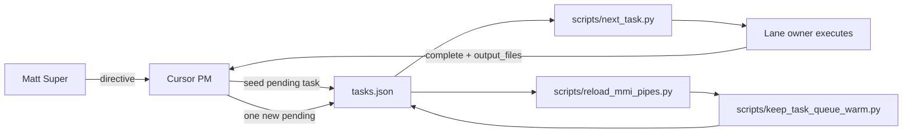

# MMI Phase-2 MVP Architecture

Last updated: 2026-06-28  
Authority: Matt (Super)  
Prepared by: Cursor PM  
Source: Matt phase-2 directive 2026-06-28 and local project-brain files only

---

## Product Mission

MMI is a **local, queue-driven multi-agent operating system** for Matt's work. It keeps scope bounded, routes work to the correct lane, and surfaces the next action through a local command center backed by `tasks.json` and the project brain under `mmi/project_brain/`.

**NEEDS MATT (refinement):** External-facing one-liner for stakeholders. Phase-2 proceeds with the local operating mission above until Matt refines it.

---

## Phase-2 Goal

Turn PM bootstrap into the **first runnable MMI MVP**: a local command center that reads the task queue and project brain, shows pipe health, and hands the next bounded action to the correct lane owner.

Success for Phase-2 MVP:

1. One pending task visible via deployer scripts with id, score, and assignee.
2. Command-center spec defines what Matt sees locally (task, pipe status, next action, brain links).
3. All work stays MMI-only; paused lanes remain untouched.

---

## MVP Boundaries

### In scope

- Local repo: `C:\MMI` (`/mnt/c/MMI` in WSL)
- `tasks.json` and deployer scripts in `scripts/`
- Project brain under `mmi/project_brain/`
- Command-center **spec** then skeleton (Codex backbone lane)
- PM status docs and queue hygiene (Cursor PM lane)

### Out of scope (Phase-2 MVP)

- Social Architect Phase 1 app or portal work
- DAX, Trades, or market-collector lanes
- NorthStar repo sync or copy without Matt authorization
- npm builds, web deploys, or external service spend
- Product feature invention beyond command-center visibility
- Auto-running `task_runner.py` for PM tasks

---

## What MMI Is

| Aspect | Definition |
|---|---|
| **Operating model** | Matt (Super) → Cursor PM (queue) → lane owners (Codex, Claude, Gemini, ChatGPT) |
| **Source of truth** | `tasks.json` for next work; `mmi/project_brain/` for scope, routing, and status |
| **Deployer** | Python scripts that reload pipes, warm the queue, and print the next task |
| **Phase-2 deliverable** | Local command center that makes queue + brain state visible and actionable |

---

## What MMI Is Not

- Not Social Architect Phase 1 (paused)
- Not DAX or Trades (paused unless Matt reactivates)
- Not a copy of NorthStar governance/runtime unless Matt authorizes
- Not an autonomous agent that invents scope or deploys without Super approval
- Not a replacement for lane-specific owners (PM routes; it does not absorb every lane)

---

## Agent Role Map

| Role | Owner | Phase-2 responsibility |
|---|---|---|
| Super | Matt | Product mission, build auth, GATED, scope changes |
| PM | Cursor | Queue intake, status docs, routing, `tasks.json` hygiene |
| Backbone / runtime | Codex | Command-center spec, scripts, repo plumbing |
| Design | Claude | Architecture and interface docs when assigned |
| Audit | Gemini Paid API | Audit passes, completion gate |
| Main research | Gemini | Primary research when assigned |
| Deep research | ChatGPT | Secondary research when assigned |

See `mmi/project_brain/status/MMI_LANE_ROUTING.md` for the full routing tree.

---

## Local Task Queue Flow



1. Matt provides a bounded directive.
2. Cursor PM completes the current task and seeds **exactly one** new pending task.
3. `reload_mmi_pipes.py` confirms pipe status (LOADED, HOLD, or BLOCKED).
4. `next_task.py` prints the active task id, score, assignee, and instruction.
5. Assignee executes; PM marks completed with `completed_at`, `completed_by`, `result_summary`, `output_files`.

---

## Pipe Reload Flow

`scripts/reload_mmi_pipes.py`:

1. Calls `keep_task_queue_warm.seed_if_dry()` if the fixed backlog is exhausted (bootstrap only; stops when hold is active).
2. Loads `tasks.json` and finds the first task with status in `{pending, queued, todo, in-progress}`.
3. If no active task and `mmi-await-matt-phase2` was paused → **HOLD** (now cleared for Phase-2).
4. If active task is non-MMI → **BLOCKED**.
5. If active MMI task exists → **LOADED** with task id, score, assignee, instruction.

---

## Project-Brain Folder Responsibilities

| Folder | Purpose |
|---|---|
| `mission/` | Product mission, goals, milestone map |
| `architecture/` | MVP architecture, command-center spec, build scope docs |
| `lanes/` | Lane-specific notes and handoffs |
| `status/` | Active scope, routing, registry, deployer checks, phase start/closeout |

Root `mmi/project_brain/README.md` indexes the tree. Status files are the PM operating layer; architecture files are design/backbone inputs for Codex and Claude.

---

## Safety Gates

| Gate | Rule |
|---|---|
| Scope | MMI only; non-MMI tasks stay paused/completed |
| Queue | At most one pending task seeded per PM completion |
| Hold | No substantive build tasks while awaiting Matt directive (hold cleared 2026-06-28) |
| Lane | PM routes; does not implement Codex/Claude/research/audit work |
| Build auth | Matt GATED before substantive deploy or spend |
| NorthStar | No copy/sync without Matt authorization |

---

## First Three Build Increments

| # | Task | Owner | Output |
|---|---|---|---|
| 1 | Command-center spec | Codex | `architecture/MMI_COMMAND_CENTER_SPEC.md` |
| 2 | Command-center skeleton (read-only UI or CLI panel) | Codex | TBD after spec — local script or static view |
| 3 | Wire skeleton to `tasks.json` + pipe status | Codex | Live display of task id, score, assignee, pipe status, next action, brain links |

Increment 1 is **pending now** (`mmi-command-center-spec`). Increments 2–3 are sequenced after Codex spec review and Matt approval; not seeded until increment 1 completes.

---

## Do Not Touch

Unless Matt explicitly reactivates the lane:

| Area | Examples |
|---|---|
| Social Architect Phase 1 | `web/`, portal, worker panel, Phase 1 docs |
| DAX | DAX scripts, DAX tasks, DAX lanes |
| Trades | Trade scripts, market collectors used for Trades |
| Old Phase 1 queue | `phase1-stability-audit` and similar — keep **paused** |
| NorthStar repo | `/home/socialarchitect/northstar` — separate surface; do not merge without auth |

---

## Terminal Commands (Matt)

Run from repo root `C:\MMI`:

```powershell
cd C:\MMI
python scripts/reload_mmi_pipes.py
python scripts/next_task.py
```

WSL equivalent:

```bash
cd /mnt/c/MMI
python3 scripts/reload_mmi_pipes.py
python3 scripts/next_task.py
```

**Expected after Phase-2 start:**

- `reload_mmi_pipes.py` → `PIPE STATUS: LOADED`, task `mmi-command-center-spec`, score `88`, assignee Codex
- `next_task.py` → same task id, score, and assignee

Optional watch mode:

```powershell
python scripts/reload_mmi_pipes.py --watch --seconds 60
```

---

## Document Index

| File | Role |
|---|---|
| `status/MMI_ACTIVE_SCOPE.md` | Scope lock |
| `status/MMI_LANE_ROUTING.md` | Lane owners and routing |
| `status/MMI_TASK_REGISTRY_LOCAL.md` | Queue conventions |
| `status/MMI_DEPLOYER_QUEUE_CHECK.md` | Deployer verification |
| `mission/MMI_MISSION_BRIEF.md` | Mission brief |
| `architecture/MMI_PHASE2_MVP_ARCHITECTURE.md` | This document |
| `status/MMI_PHASE2_START.md` | Phase-2 kickoff record |
