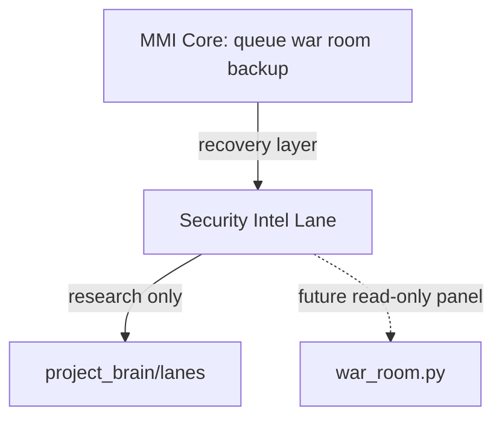

# MMI Security Intel — Product Scope

Date: 2026-06-29  
Authority: Matt (Super) — decision **A** (activate product lane for both research briefs)  
Prepared by: Cursor PM

---

## Product thesis (draft)

**MMI Security Intel** helps SMB-scale operators **understand, prioritize, and recover from** modern automated threats — starting with research synthesis and local operator playbooks, not enterprise SOC software.

Aligned with **local-first MMI**: the Mini PC and cold backup remain the recovery anchor; intel lane explains *why* and *what to do*, not a cloud runtime.

---

## Inputs (ingested)

1. Polymorphic ransomware / adversarial email fraud (Gemini deep dive)  
2. SMB threat landscape / Big Three / mitigation trends (Gemini brief)

Stored under `mmi/project_brain/lanes/RESEARCH_*.md`.

---

## MVP boundaries (v1 — proposed, needs Claude spec)

### In scope

| Deliverable | Description |
|-------------|-------------|
| **Intel brief template** | ATT&CK-tagged, SMB-scoped, source-status field |
| **Research index** | `lanes/` index linking research → recommendations |
| **Operator opsec checklist** | Mini PC: MFA, phish discipline, backup cadence, restore drill |
| **Local intel view (optional v1.1)** | Read-only CLI or war room section — **after** war room v1 ships |

### Out of scope (v1)

| Item | Reason |
|------|--------|
| Endpoint agent swarm | Research only; enterprise SOC |
| Live telemetry (Sysmon/EDR) | Machine policy, not MMI Python v1 |
| Automated blocking/containment | Cloud/runtime; conflicts local-first |
| External publication of unverified stats | Evaluator gate required |

---

## Relationship to core MMI

Core MMI **continues** on current pipeline. Security intel **extends** via separate pipeline entries — no merge until MVP approved.

---

## Success criteria (bootstrap)

- [x] Matt decision A recorded  
- [x] Both research artifacts filed in `lanes/`  
- [x] Lane doc exists  
- [ ] Claude MVP architecture spec  
- [ ] Source verification pass on key statistics  
- [ ] Matt build auth for first Codex intel tool (if any)

---

## Hard stops

- MMI repo only (`MMI`)  
- No NorthStar sync without Matt auth  
- No npm / `web/` / `ops/run.py`  
- Unsourced stats marked **NEEDS VERIFY** until Evaluator clears  

---

## Next pipeline owner

**Claude** — `mmi-security-intel-product-scope` → output this file’s successor: `MMI_SECURITY_INTEL_MVP_ARCHITECTURE.md`

Queued **after** `mmi-war-room-v1` completes.
