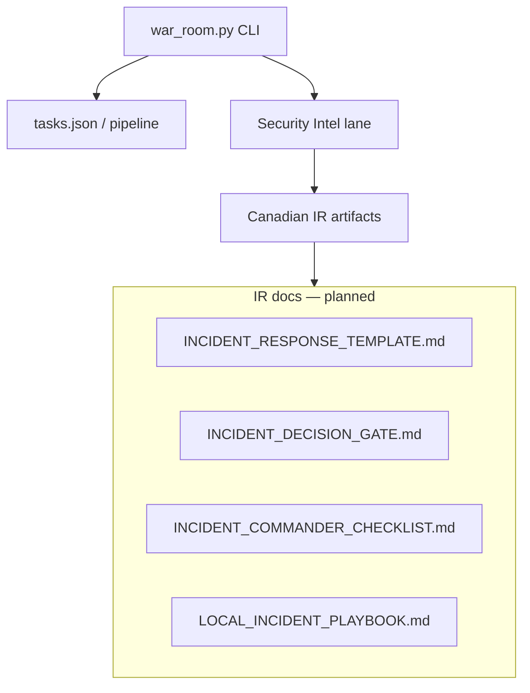

# MMI War Room Spec — V1.1-PROTOTYPE

Last updated: 2026-06-30  
Authority: Matt (Super) — Canadian operator  
Status: **PROTOTYPE** — v1 shipped; v1.1 defines integration with Security Intel + Canadian IR  
Repo: `C:\MMI` / `/mnt/c/MMI`

---

## What the war room is

Matt's **local operations dashboard** for running MMI on the workstation:

| Surface | Role |
|---------|------|
| **Monitor 1 (execute)** | Cursor Editor — code, terminal, `tasks.json`, scripts, git |
| **Monitor 2 (orient)** | Cursor Agents + `mmi/war_room.py --watch` — pipe, lanes, backup, brain links |

**Not:** NorthStar governance, hosted web app, LangGraph substrate, cloud runtime, or automated agent routing.

The war room **orients**; agent tabs **execute**. Human-steered lanes only.

---

## V1 — SHIPPED (matches `mmi/war_room.py`)

**Task:** `mmi-war-room-v1` — completed by Codex.

```bash
python mmi/war_room.py
python mmi/war_room.py --watch --seconds 30
python mmi/war_room.py --json
python mmi/war_room.py --no-seed   # compatibility flag; war room is read-only by default
```

### Display sections (implemented)

| Section | Source | Status |
|---------|--------|--------|
| **PIPE** | `tasks.json` via `command_center.build_state()` | Done |
| **ACTIVE TASK** | id, score, assignee, tier, status, instruction | Done |
| **BLOCKERS** | pipe detect (multi-active, non-MMI, JSON errors) | Done |
| **NEXT ACTION** | `command_center.next_action_for()` | Done |
| **LANE MAP** | Static table in `war_room.py` | Done |
| **BACKUP** | Tail of `MMI_BACKUP_PUSH_LOG.json` | Done |
| **OPERATOR** | Cheatsheet (reload, complete, backup, command center fallback) | Done |
| **PROJECT BRAIN** | Links to scope, policy, routing, war room docs | Done |

### Pipe states (inherited from command center)

| State | Meaning |
|-------|---------|
| **LOADED** | One MMI active task |
| **DRY** | No pending task |
| **HOLD** | Paused hold task |
| **BLOCKED** | Invalid queue or non-MMI active task |

### V1 hard rules (unchanged)

- Read-only — does not mutate `tasks.json` or seed pipeline
- Local CLI only — no npm / `web/` / NorthStar
- MMI scope only (`mmi-*` tasks, `PROJECT: MMI` instructions)

---

## V1.1-PROTOTYPE — what this spec adds

V1.1 is **not** a rewrite of the CLI. It defines how the war room **connects** to Matt's **Canada-first Security Intel** and **Incident Response (IR)** artifacts — turning the panel from "queue visibility" into "operator war room + compliance readiness."

### Canada-first doctrine (project-wide for intel/IR)

Matt is Canadian. MMI Security Intel and IR artifacts are **Canada-first by default**:

| Layer | Geography |
|-------|-----------|
| Core MMI ops (queue, backup, war room CLI) | Geography-agnostic |
| Research, verification, intel briefs, IR templates | **Canada-first** — see `lanes/MMI_RESEARCH_RIGOR_PROTOCOL.md` |
| Global vendor data (DBIR, IBM, etc.) | Allowed only as `[Global Data — Requires Localization]` with Canadian cross-reference |

**Is Canada-first vital?** For **intel and IR — yes.** For **pipe/backup/war room mechanics — no.** The project stays one stack; the **Truth Database** and **incident playbooks** must reflect Canadian law (PIPEDA, Quebec Law 25 where applicable), CCCS guidance, CAFC reporting, and Canadian primary sources (StatCan, OPC, CIRA) — not US zombie stats or generic GDPR-first framing unless Matt explicitly operates in those jurisdictions.

---

## War room artifact stack (V1.1 target)



| Artifact | Path (target) | Role | Status |
|----------|---------------|------|--------|
| IR template | `intel/templates/INCIDENT_RESPONSE_TEMPLATE.md` | Canadian-first PIR/breach questions (PIPEDA/Law 25, impact-focused) | **Research done — not filed yet** |
| Decision gate | `intel/INCIDENT_DECISION_GATE.md` | If-then matrix: impact + geo → regulatory flags | **Design seed — not built** |
| Commander checklist | `opsec/INCIDENT_COMMANDER_CHECKLIST.md` | Roles: Commander / Tech / Compliance | **Design seed — not built** |
| Local playbook | `intel/LOCAL_INCIDENT_PLAYBOOK.md` | CCCS portal, CAFC forms, notification framework | **Research seed — not built** |
| Intel brief template | `intel/templates/INTEL_BRIEF_TEMPLATE.md` | Threat intel synthesis (Claude task active) | **Pending** |

Matt's quick IR research (6-section framework: threat vector, business impact, mitigation, legal, comms, recovery) **fits** as the skeleton inside `INCIDENT_RESPONSE_TEMPLATE.md` — localized for Canada, not copied as US-generic.

---

## V1.1 war room CLI gaps (prototype integration)

| Gap | V1.1 action |
|-----|-------------|
| Security Intel not in brain links | Add links: rigor protocol, verification, evaluator pass, intel index |
| No research integrity row | Show: verification sign-off, Canada localization status |
| IR artifacts not linked | Add `PROJECT BRAIN` entries when templates land |
| Spec said v1 "not done" | **Corrected** — v1 done; this doc is v1.1 |
| `MMI_TERMINAL_ALIASES.md` | Still optional — cheatsheet in `war_room.py` covers basics |
| Git branch visibility | Optional v1.2 — show `mmi-phase2-commit` / last backup age |

**V1.1 does not require** npm UI, SOAR, or live telemetry. Decision gate is a **markdown logic matrix + human checklist**, not an automated compliance engine, unless Matt authorizes Codex build later.

---

## Canadian IR — how Matt's research fits

### What you already nailed (conversation audit)

| Lever | Why it matters for MMI |
|-------|------------------------|
| **PIPEDA / Law 25** | Legal clock starts at "real risk of significant harm" — not when IT finishes containment |
| **Impact over data loss** | Payroll, supply chain, workday disruption — matches CCCS 2026 prioritization |
| **6-section IR framework** | Maps cleanly to template sections (see below) |

### Mapping: generic IR questions → Canadian template sections

| Your 6 sections | Canadian template field |
|-----------------|-------------------------|
| 1. Incident details & root cause | Threat vector, timeline, initial access — ATT&CK-tagged |
| 2. Business impact & scope | Affected assets, exfil, operational disruption — **impact-first** |
| 3. Mitigation & containment | Containment status, eradication — **advisory only** in MMI (no auto-contain) |
| 4. Legal & regulatory | **PIPEDA**, Law 25 (QC), OPC notification, CAFC — `[REQ:]` flags |
| 5. Stakeholder comms | Internal/external messaging — pre-approved frameworks |
| 6. Recovery & remediation | Restore timeline, security enhancements — ties to local backup (`--backup-and-push`) |

### Three high-leverage seeds (aligned with your vision)

| Priority | Seed | Owner | Output |
|----------|------|-------|--------|
| **1** | File IR template | Claude / Matt | `intel/templates/INCIDENT_RESPONSE_TEMPLATE.md` |
| **2** | Decision gate logic | Claude | `intel/INCIDENT_DECISION_GATE.md` — if `Impact=Payroll` + `Geo=Canada` → `[REQ: PIPEDA Notification]` + `[REQ: CAFC Report]` |
| **3** | Commander checklist | Claude | `opsec/INCIDENT_COMMANDER_CHECKLIST.md` — Commander / Tech / Compliance roles |
| **4** | Local evidence backer | Gemini + ChatGPT | `intel/LOCAL_INCIDENT_PLAYBOOK.md` — CCCS portal, CAFC forms, PIPEDA notification framework |

**Recommended order:** Complete `INTEL_BRIEF_TEMPLATE` (active pipe task) → file IR template → decision gate → commander checklist → local playbook.

---

## Dual-monitor operating model (unchanged)

See `status/MMI_WAR_ROOM_SETUP.md`.

| Monitor | Tool |
|---------|------|
| 1 | Cursor Editor + WSL terminal |
| 2 | Agent tabs + `python mmi/war_room.py --watch --seconds 30` |

During an incident (future): war room CLI stays **read-only**; IR templates are **human-driven** docs opened from brain links — not auto-triggered.

---

## Implementation map

| File | Owner | Version |
|------|-------|---------|
| `mmi/war_room.py` | Codex | **v1 done** |
| `mmi/command_center.py` | Codex | v1 done (shared engine) |
| `architecture/MMI_WAR_ROOM_SPEC.md` | Cursor PM | **this doc — v1.1-PROTOTYPE** |
| `status/MMI_WAR_ROOM_SETUP.md` | Cursor PM | setup guide |
| `lanes/MMI_RESEARCH_RIGOR_PROTOCOL.md` | Matt + PM | Canada-first Truth Database |
| IR / intel templates | Claude + research lanes | v1.1 artifacts |

### V1.1 Codex scope (when Matt authorizes)

Minimal CLI update only:

- Extend `BRAIN_LINKS` with Security Intel + IR template paths
- Optional `intel_status()` row: last verification verdict, Canada localization flag
- No mutation, no cloud, no compliance automation

---

## Hard stops (unchanged)

- MMI only — no Social Architect, DAX, Trades, NorthStar bridge
- Local-first — cloud = cold B2 backup only
- Advisory IR — templates inform; they do not block, contain, or report on Matt's behalf
- No unverified stats in IR docs — Crucible + Canada-first protocol
- No endpoint swarm / live SOAR / automated regulatory filing

---

## Build history

| Task | Status |
|------|--------|
| `mmi-war-room-v1` | **Completed** — `mmi/war_room.py` |
| `mmi-intel-brief-template` | Active — Claude |
| V1.1 brain links + intel row | Queued — after IR template filed |

---

## Authority

This spec supersedes the 2026-06-29 v1 draft table that listed war room as "Not done." V1 is shipped. V1.1-PROTOTYPE defines Canadian IR integration and CLI gaps without expanding into enterprise SOC scope.
